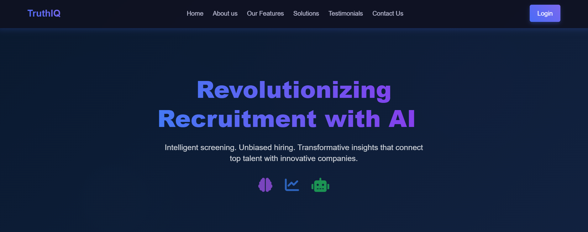

# TruthIQ: AI-Powered Recruitment Platform

## 🚀 Introduction
Recruitment processes often face inefficiencies, biases, and delays when screening candidates. **TruthIQ** is an AI-powered recruitment solution designed to streamline hiring, eliminate bias, and provide real-time insights for recruiters. Our platform enhances candidate assessment, salary benchmarking, and hiring campaign analytics.

## 🎯 Problem Statement
The recruitment industry struggles with:
- **Bias in hiring decisions** ❌
- **Lack of real-time salary insights** 📊
- **Inefficient recruitment campaigns** ⏳
- **Limited candidate assessment tools** 🔍

Manual screening is time-consuming and prone to subjective decisions. **TruthIQ** solves these challenges through automation and AI-driven intelligence.

## 💡 Our Solution: TalentIQ
TruthIQ offers an AI-powered recruitment platform that provides:
✅ **AI-driven resume screening** 📄  
✅ **Bias detection and elimination** ⚖️  
✅ **Dynamic salary benchmarking** 💰  
✅ **Recruitment campaign analytics** 📈  
✅ **Video interview analysis** 🎥  

## 🛠️ Tech Stack
TruthIQ is built using cutting-edge technologies:
- **Machine Learning & AI:** TensorFlow, PyTorch, Scikit-learn 🤖
- **Natural Language Processing:** SpaCy, Hugging Face BERT 📝
- **Cloud & Hosting:** Firebase, AWS ☁️
- **Data Visualization:** Power BI, Chart.js 📊

## 🏗️ Key Features
- **Live Learning Models:** AI adapts dynamically to recruiter-uploaded data.
- **Automated Resume Screening:** Reduces screening time by 75%.
- **Bias Detection:** Ensures fair hiring practices.
- **Scalable & Adaptable:** Grows with recruiter needs and global hiring trends.

## 🔥 Impact & Benefits
📌 **Reduces hiring time** by 60%—100 resumes screened in under 10 minutes.  
📌 **Promotes workplace diversity** by eliminating hiring biases.  
📌 **Reduces hiring costs** by 30% and cuts time-to-hire from 30 days to 12 days.  
📌 **Saves companies up to $1.5M annually** in recruitment expenses.  
📌 **Environmentally friendly**—eliminates paper-based recruitment processes.

## 📌 Development & Deployment
🔹 **Pre-trained Models** – Uses NLP models like BERT for parsing & bias detection.  
🔹 **Cloud-Based Deployment** – Hosted on AWS/Firebase for scalability.  
🔹 **Iterative Testing** – Ensures reliability under high-volume usage.

## 📂 Project Architecture & Workflow
For detailed insights into our architecture and implementation, check out our **workflow document**:  
🔗 [Project Analysis & Workflow](https://drive.google.com/drive/folders/1fr_gwpLSByZB3BFwOz5ET6Ir9GGsfs05?usp=sharing)

## 👥 Team 404_not_found
- **Srinjoy Pramanik** - [GitHub](https://github.com/Srinjoy2004) | [LinkedIn](https://www.linkedin.com/in/srinjoy-pramanik-48560b246/)
- **Arittra Bag**  
- **Sourin Pal**  
- **Arpan Chowdhury**  

🏫 **Netaji Subhash Engineering College** (3rd Year)

## 📜 License
This project is licensed under the **MIT License**.

---
✨ _"We don't just solve problems; we redefine them."_ ✨
